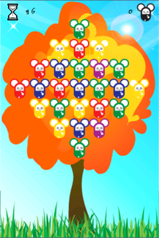

It's all about changing colors.
Select 2 chacos to let them swap their color.
Group 2 or more chacos with same color together horizontally or vertically to score but watch out that your time does not run out. Gain time every 100 points.
Increase your Highscores and challenge your friends.

Chaco was the first game I've worked on as [orkitec](/about/) and i used an early version of my engine for it. The main goal at the time was just to finish and release something to make sure games with the orkitec game engine can be released on the apple app store and to have something to show for. 

Chaco has been removed from the stores since it would need to be updated to use recent libs from iOS and Android.

